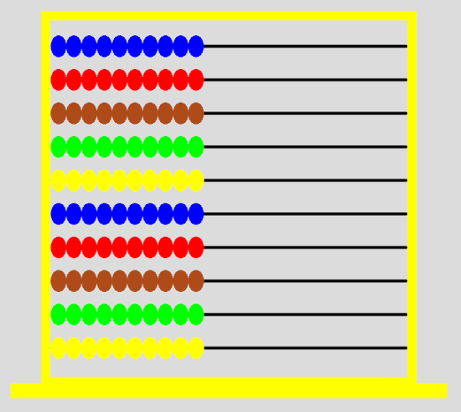

# Abacus Simulator




## Overview

This is an abacus simulator, which can simulate a standard school abacus with 10 rows of beads. It can do basic arithmetic operations like addition, subtraction, multiplication, and division (well, currently only addition, but hopefully soon I'll have it working for all of them). In the future, it will also be able to convert between base systems, such as decimal to hexadecimal or vice versa.

It animates the beads in real time, as shown in the [clip where I figured out how to fix it](https://www.youtube.com/clip/UgkxOIreMiHiVHz_q8NlKkUF8gZzVjAxyMu4). You can also watch that [entire video](https://youtu.be/E3Te0hEpWiU) showing how I used AI to fix my animations years after I started working on this project. I also made an [abacus tutorial video](https://www.youtube.com/watch?v=_bmYl-zuoWk) back in high school.

## Setup

Setup steps:

1. Clone the repository via:

```bash
git clone https://github.com/zinsy23/abacus-simulator.git
```

2. Install dependencies via:

```bash
npm i
```

## Running the simulator

To run the simulator, run the following command:

```bash
npm start
```
or
```bash
node server.js
```

## Usage

To use the simulator, open your browser and navigate to `http://localhost:8000`. Use the developer console to interact with the simulator. Currently, the following operations are supported:
- `add(a, b)` - Add two numbers together
- `clearBeads()` - Reset the beads to their initial state
- `repeat()` - Add two random numbers together 1500 times

To add two numbers together, use the `add()` function. For example, to add 3 and 4, you can use the following code:

```javascript
add(3, 4);
```

You can also add more complex expressions, such as 23914 and 76334:

```javascript
add(23914, 76334);
```

To reset the beads to their initial state, use the `clearBeads()` function:

```javascript
clearBeads();
```

You can also use the `repeat()` function to add two random numbers together, which currently runs 1500 times (fun to use if you like watching the beads move a lot):

```javascript
repeat();
```

> **Note:** You can also control individual beads by modifying their array elements directly. `row[index]` is where the bead states are stored. For example, to set the bottom row to have 5 beads on, you can use the following code:

```javascript
row[0] = 5;
```

The top row can be referenced as `row[9]`. It counts up from the bottom row, so the bottom row is `row[0]`, the next row up is `row[1]`, and so on.


## Future Work

- Add support for subtraction, multiplication, and division
- Fix a bug with the `add()` function where certain numbers don't add up correctly
- Add support for converting between base systems